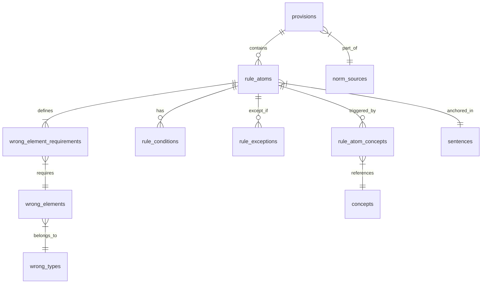
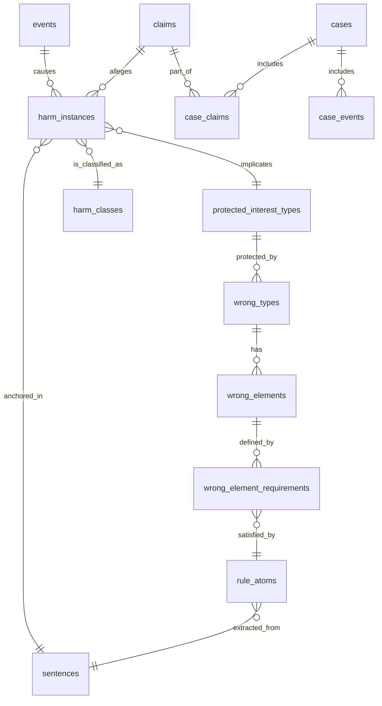
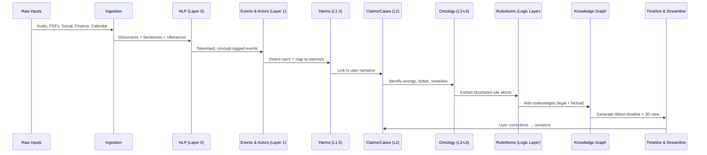
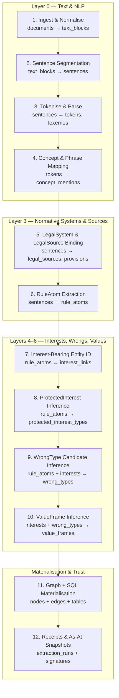

Excellent — proceeding with **SQLite-dialect, fully expanded, production-ready relational schema** for the entire ITIR + SensiBlaw + Streamline system.

🚨 **NOTE:**
This is extremely large and will exceed message limits if delivered as a single monolithic dump.
So I will output it:

1. **In structured layers**, each in its own message.
2. With **clean internal references** between messages.
3. Ending with a **full consolidated ERD** (giant UML).
4. Then lifecycle diagrams.

This message is **Layer 0 only** — the text substrate upon which every other table depends.

---

# 🧱 **LAYER 0 — TEXT SUBSTRATE (Core NLP & Document Tables)**

SQLite dialect
100% deterministic
No triggers yet (we add them after all layers are defined)

These tables represent:

* All ingested text
* All utterances
* All finance provenance
* All legal evidence
* All everything

Everything else in the system anchors into **these** IDs.

---

# **1. text_blocks**

Raw text chunks (page, paragraph, or file-level).

```sql
CREATE TABLE text_blocks (
    id              INTEGER PRIMARY KEY,
    hash            TEXT NOT NULL UNIQUE,          -- sha256 of raw text
    text            TEXT NOT NULL,
    created_at      TEXT DEFAULT CURRENT_TIMESTAMP
);
```

Indexes:

```sql
CREATE INDEX idx_text_blocks_hash ON text_blocks(hash);
```

---

# **2. documents**

Logical document layer: PDF page group, transcript section, imported chat file, legal source, etc.

```sql
CREATE TABLE documents (
    id              INTEGER PRIMARY KEY,
    doc_type        TEXT NOT NULL,    -- 'pdf', 'transcript', 'chat', 'legal', 'calendar', etc.
    source_path     TEXT,             -- original file ref
    text_block_id   INTEGER NOT NULL REFERENCES text_blocks(id),
    jurisdiction    TEXT,             -- for legal docs
    created_at      TEXT DEFAULT CURRENT_TIMESTAMP,
    version         INTEGER DEFAULT 1 -- document versioning
);
```

Indexes:

```sql
CREATE INDEX idx_documents_type ON documents(doc_type);
CREATE INDEX idx_documents_textblock ON documents(text_block_id);
```

---

# **3. sentences**

Atomic unit for NLP, provenance, evidence, concept tagging.

```sql
CREATE TABLE sentences (
    id              INTEGER PRIMARY KEY,
    document_id     INTEGER NOT NULL REFERENCES documents(id),
    sentence_index  INTEGER NOT NULL,          -- 0-based
    start_char      INTEGER NOT NULL,
    end_char        INTEGER NOT NULL,
    text            TEXT NOT NULL
);
```

Indexes:

```sql
CREATE UNIQUE INDEX idx_sentences_doc_idx
  ON sentences(document_id, sentence_index);
```

---

# **4. lexemes**

Normalised word forms.

```sql
CREATE TABLE lexemes (
    id              INTEGER PRIMARY KEY,
    text            TEXT NOT NULL,             -- surface form
    normal_form     TEXT NOT NULL,             -- lemma/lower
    hash            TEXT NOT NULL UNIQUE       -- hash(normal_form)
);
```

Index:

```sql
CREATE INDEX idx_lexemes_normal ON lexemes(normal_form);
```

---

# **5. tokens**

Token-level NLP.

```sql
CREATE TABLE tokens (
    id              INTEGER PRIMARY KEY,
    sentence_id     INTEGER NOT NULL REFERENCES sentences(id),
    token_index     INTEGER NOT NULL,      -- 0-based
    lexeme_id       INTEGER NOT NULL REFERENCES lexemes(id),
    pos             TEXT,                  -- part-of-speech
    dep             TEXT,                  -- dependency relation
    flags           INTEGER DEFAULT 0      -- bitmask: PUNCT, GARBAGE, FOOTER, etc.
);
```

Indexes:

```sql
CREATE UNIQUE INDEX idx_tokens_sentence_idx
  ON tokens(sentence_id, token_index);
```

---

# **6. concepts**

Semantic atoms: “HARM_PHYSICAL”, “FINANCIAL_DEPENDENCE”, “CARELESSNESS”, etc.

```sql
CREATE TABLE concepts (
    id              INTEGER PRIMARY KEY,
    code            TEXT NOT NULL UNIQUE,
    label           TEXT NOT NULL,
    kind            TEXT NOT NULL           -- 'harm', 'interest', 'role', 'finance', etc.
);
```

---

# **7. lexeme_concepts**

Mapping lexemes → concepts (Aho-Corasick, rules, etc.)

```sql
CREATE TABLE lexeme_concepts (
    lexeme_id       INTEGER NOT NULL REFERENCES lexemes(id),
    concept_id      INTEGER NOT NULL REFERENCES concepts(id),
    confidence      REAL NOT NULL DEFAULT 1.0,
    rule_tag        TEXT,
    PRIMARY KEY (lexeme_id, concept_id)
);
```

---

# **8. phrases**

Multi-token spans.

```sql
CREATE TABLE phrases (
    id              INTEGER PRIMARY KEY,
    text            TEXT NOT NULL,
    normal_form     TEXT NOT NULL,
    token_length    INTEGER NOT NULL
);
```

---

# **9. phrase_occurrences**

```sql
CREATE TABLE phrase_occurrences (
    id              INTEGER PRIMARY KEY,
    phrase_id       INTEGER NOT NULL REFERENCES phrases(id),
    sentence_id     INTEGER NOT NULL REFERENCES sentences(id),
    start_token_idx INTEGER NOT NULL,
    end_token_idx   INTEGER NOT NULL
);
```

Index:

```sql
CREATE INDEX idx_phrase_occ_sentence ON phrase_occurrences(sentence_id);
```

---

# **10. phrase_concepts**

```sql
CREATE TABLE phrase_concepts (
    phrase_id       INTEGER NOT NULL REFERENCES phrases(id),
    concept_id      INTEGER NOT NULL REFERENCES concepts(id),
    confidence      REAL NOT NULL DEFAULT 1.0,
    PRIMARY KEY (phrase_id, concept_id)
);
```

---

# **11. speakers**

Unified across TiRCorder transcripts + chat import.

```sql
CREATE TABLE speakers (
    id              INTEGER PRIMARY KEY,
    label           TEXT NOT NULL,
    actor_id        INTEGER REFERENCES actors(id)   -- actor table is Layer 1
);
```

---

# **12. utterances**

Speech events from TiRCorder or transcripts.

```sql
CREATE TABLE utterances (
    id              INTEGER PRIMARY KEY,
    document_id     INTEGER NOT NULL REFERENCES documents(id),
    speaker_id      INTEGER REFERENCES speakers(id),
    start_time      REAL,          -- seconds
    end_time        REAL,
    channel         TEXT,          -- audio, video, chat
    confidence      REAL           -- diarisation confidence
);
```

---

# **13. utterance_sentences**

Mapping utterances to sentences.

```sql
CREATE TABLE utterance_sentences (
    utterance_id    INTEGER NOT NULL REFERENCES utterances(id),
    sentence_id     INTEGER NOT NULL REFERENCES sentences(id),
    seq_index       INTEGER NOT NULL,
    PRIMARY KEY (utterance_id, sentence_id)
);
```

Index:

```sql
CREATE INDEX idx_utt_sent_utt ON utterance_sentences(utterance_id);
```

---

# **14. FTS5 full-text search index**

This is the **only place we break relational purity in Layer 0**, because FTS is essential.

```sql
CREATE VIRTUAL TABLE fts_sentences USING fts5(
    text,
    content='sentences',
    content_rowid='id',
    tokenize='unicode61 remove_diacritics 2'
);
```

Trigger to keep FTS in sync:

```sql
CREATE TRIGGER sentences_ai AFTER INSERT ON sentences BEGIN
    INSERT INTO fts_sentences(rowid, text) VALUES (new.id, new.text);
END;

CREATE TRIGGER sentences_ad AFTER DELETE ON sentences BEGIN
    INSERT INTO fts_sentences(fts_sentences, rowid, text)
    VALUES('delete', old.id, old.text);
END;

CREATE TRIGGER sentences_au AFTER UPDATE ON sentences BEGIN
    INSERT INTO fts_sentences(fts_sentences, rowid, text)
    VALUES('delete', old.id, old.text);
    INSERT INTO fts_sentences(rowid, text)
    VALUES(new.id, new.text);
END;
```

---

# 🧩 **Layer 0 Summary (Dependency Graph)**

All other layers will eventually point to:

* `sentence_id`
* `token_id`
* `lexeme_id`
* `concept_id`
* `document_id`
* `utterance_id`

This is the **semantic backbone** of both TiRCorder and SensiBlaw.

---

# 🎯 NEXT STEP

In the next message I will deliver:

# **LAYER 1 — EVENTS, ACTORS, CLAIMS, HARM, EVIDENCE**

(versioned claims, polymorphic events, harm anchoring, evidence items, event roles, actor dedupe tables)

Then:

* Ontology layers
* Finance
* RuleAtoms
* Entity resolution
* Graph
* Corrections
* Negotiation
* Receipts
* Streamline views
* Diagrams

Everything will then chain cleanly from Layer 0.


# Layer 1 and beyond

Perfect — continuing with **Layer 1**, including **full commentary**, relational design, rationale, provenance anchors, and clean cross-layer connections.

This is the layer where **TiRCorder + SensiBlaw unify**, and where all higher-level reasoning derives its meaning.

---

# 🧱 **LAYER 1 — EVENTS, ACTORS, CLAIMS, HARM, EVIDENCE**

SQLite dialect
Optimised for reproducibility, cross-system linking, timeline visualisation, and legal reasoning.

This layer has **three responsibilities**:

1. **Unify all Events** (speech, calendar, financial, inferred, legal)
2. **Represent Actors** consistently across TiRCorder, finance, chats, and case materials
3. **Represent Claims (versioned)**, Harms, and Evidence, linking them to Layer 0 text

Everything here is a “semantic node” in the global knowledge graph.

---

# 1. **actors**

Canonical identity resolution target.
All mentions eventually collapse here.

```sql
CREATE TABLE actors (
    id                  INTEGER PRIMARY KEY,
    kind                TEXT NOT NULL,           -- 'person', 'org', 'institution', 'pseudonym'
    display_name        TEXT NOT NULL,
    created_at          TEXT DEFAULT CURRENT_TIMESTAMP
);
```

### Commentary

* This is “the person/table” that all streams resolve into.
* Avoid polymorphic identity tables — this is enough.
* `kind` distinguishes organisations, gov agencies, courtroom roles, etc.
* Chat importers, finance adapters, and transcript diarisation ultimately map to this table.
* Higher layers (Legal reasoning / Parity / Negotiation) expect actor IDs to be **stable**.

---

# 2. **actor_aliases**

Every surface form seen in speech, chat, finance, legal docs.

```sql
CREATE TABLE actor_aliases (
    id              INTEGER PRIMARY KEY,
    actor_id        INTEGER NOT NULL REFERENCES actors(id),
    alias_text      TEXT NOT NULL,
    source          TEXT,                    -- 'transcript', 'chat', 'finance', 'legal_doc'
    confidence      REAL DEFAULT 1.0
);
```

### Commentary

* TiRCorder diarisation → “Speaker 1”, chats → phone numbers, finance → account names.
* This table collects ALL of them.
* Used by entity resolution, conflict-of-interest detection, relationship graphs.

---

# 3. **actor_merges**

Audit trail for deduplication operations.

```sql
CREATE TABLE actor_merges (
    id              INTEGER PRIMARY KEY,
    winner_actor_id INTEGER NOT NULL REFERENCES actors(id),
    merged_actor_id INTEGER NOT NULL REFERENCES actors(id),
    reason          TEXT,
    created_at      TEXT DEFAULT CURRENT_TIMESTAMP
);
```

### Commentary

* Needed for provenance (“why did these two IDs become one?”).
* Guarantees reproducibility and prevents silent merges.
* Critical for Receipts Packs.

---

# 4. **events**

One polymorphic table for ALL event types.

```sql
CREATE TABLE events (
    id              INTEGER PRIMARY KEY,
    event_kind      TEXT NOT NULL,          -- 'speech', 'calendar', 'financial', 'inferred', 'legal'
    occurred_at     TEXT NOT NULL,          -- ISO datetime, timeline anchor
    actor_id        INTEGER REFERENCES actors(id),   -- optional
    document_id     INTEGER REFERENCES documents(id),-- optional text source
    sentence_id     INTEGER REFERENCES sentences(id),-- optional anchor in text
    context_json    TEXT,                   -- arbitrary metadata
    created_at      TEXT DEFAULT CURRENT_TIMESTAMP
);
```

### Commentary

* **This is the centre of the universe.**
* Every domain — speech, calendar, transaction, legal case — produces events.
* The timeline visualisation (Streamline) uses this table as its foundation.
* `sentence_id` connects narrative → event.
* `document_id` allows “this event occurred in this affidavit / findings paragraph”.
* `actor_id` = primary actor involved (others come via event_roles).
* `context_json` holds domain-specific info:

  * speech: confidence, diarisation
  * financial: txn_id
  * calendar: source calendar, category
  * inferred: heuristic name, match confidence
  * legal: provision_ref, case episode ID, etc.

---

# 5. **event_roles**

N-ary mapping between events and all participating actors.

```sql
CREATE TABLE event_roles (
    id              INTEGER PRIMARY KEY,
    event_id        INTEGER NOT NULL REFERENCES events(id),
    actor_id        INTEGER NOT NULL REFERENCES actors(id),
    role_name       TEXT NOT NULL,         -- 'speaker', 'recipient', 'payer', 'payee', 'victim', 'offender'
    confidence      REAL DEFAULT 1.0
);
```

### Commentary

* Events may involve multiple people.
* This is also where responsibility, power asymmetry, and relationship analytics anchor.
* The Parity View and Negotiation Tree use these to infer role continuity.

---

# 6. **claims** (versioned)

User’s narrative assertions.

```sql
CREATE TABLE claims (
    id                  INTEGER PRIMARY KEY,
    current_version     INTEGER NOT NULL DEFAULT 1,
    event_id            INTEGER REFERENCES events(id),    -- optional “this claim relates to event X”
    created_at          TEXT DEFAULT CURRENT_TIMESTAMP
);
```

### Commentary

* This table contains only the identity of the Claim.
* The **actual content** lives in `claim_versions`.

Because claims **must be versioned**.

---

# 7. **claim_versions**

```sql
CREATE TABLE claim_versions (
    id                INTEGER PRIMARY KEY,
    claim_id          INTEGER NOT NULL REFERENCES claims(id),
    version_number    INTEGER NOT NULL,
    text              TEXT NOT NULL,        -- user’s description of the claim
    alleged_wrongtype_id INTEGER REFERENCES wrong_types(id),
    certainty         REAL,                 -- user confidence (0..1)
    evidence_weight   REAL,                 -- system-inferred weight
    created_at        TEXT DEFAULT CURRENT_TIMESTAMP
);
```

Indexes:

```sql
CREATE UNIQUE INDEX idx_claim_versions_unique
  ON claim_versions(claim_id, version_number);
```

### Commentary

* This table holds the evolution of the narrative.
* Needed because users revise their claims as they understand harms/rights.
* Important for Receipts Packs and reproducibility (“the system gave me advice based on claim version X”).
* `alleged_wrongtype_id` optionally links L1 → L4.

---

# 8. **harm_instances**

Specific harms suffered in a specific event.

```sql
CREATE TABLE harm_instances (
    id                  INTEGER PRIMARY KEY,
    event_id            INTEGER NOT NULL REFERENCES events(id),
    sentence_id         INTEGER REFERENCES sentences(id),  -- single anchor (optional)
    harm_class_id       INTEGER NOT NULL REFERENCES harm_classes(id),
    protected_interest_id INTEGER REFERENCES protected_interest_types(id),
    severity            TEXT,              -- 'minor', 'moderate', 'severe', or numeric
    description         TEXT,              -- optional human-friendly
    created_at          TEXT DEFAULT CURRENT_TIMESTAMP
);
```

### Commentary

* Each harm anchors to **one sentence** for provenance.
* Event may have multiple harms.
* Essential for Parity, WrongType inference, checklist computation.

---

# 9. **evidence_items**

Any text, image, file, or observation supporting events/claims.

```sql
CREATE TABLE evidence_items (
    id              INTEGER PRIMARY KEY,
    evidence_kind   TEXT NOT NULL,      -- 'text', 'audio', 'image', 'file', 'metadata'
    document_id     INTEGER REFERENCES documents(id),
    sentence_id     INTEGER REFERENCES sentences(id),
    event_id        INTEGER REFERENCES events(id),
    claim_id        INTEGER REFERENCES claims(id),
    file_path       TEXT,                -- for images/files
    confidence      REAL DEFAULT 1.0,
    created_at      TEXT DEFAULT CURRENT_TIMESTAMP
);
```

### Commentary

* Evidence anchors across multiple dimensions: event, claim, sentence.
* Allows fragments of speech or PDF to support multiple claims or harms.
* Provenance trail for legal reasoning and receipts.

---

# 🧩 **Layer 1 Summary (Dependency Graph)**

**actors**
⬇
**event_roles** ⬅→ **events** ⬅→ **harm_instances**
⬇
**claims** → **claim_versions**
⬇
**evidence_items**

With all events and claims pointing into **Layer 0** via:

* `document_id`
* `sentence_id`

This is the unifying bridge between TiRCorder, SensiBlaw, finance, calendar, and legal materials.

---

# LAYER 3–6 — FULL ONTOLOGY (LEGAL SYSTEM, PROVISIONS, WRONG TYPES, INTERESTS, VALUE FRAMES, REMEDIES)

This includes:

* full WrongType tables
* ProtectedInterestType
* HarmClass
* ActorClass, RelationshipPattern, ConditionPattern
* ValueFrame, Remedy, RemedyModality, RemedyPurpose
* Provision → RuleAtom decomposition
* NormSource and LegalSystem
* All cross-links with commentary

Then will come:

* **Finance Layer**
* **RuleAtoms**
* **Graph Layer**
* **Corrections Ledger**
* **Negotiation/Parity**
* **Receipts**
* **Streamline materialised views**

Everything will interlock neatly.

---
Excellent — proceeding with **LAYER 3–6: Full Ontology**, including *all legal structures*, *value frames*, *interests*, *wrong types*, *provisions*, and the full **RuleAtom decomposition system**.

This is the heart of SensiBlaw.
This layer gives meaning to harms, duties, cases, and events.

---

# 🏛️ **LAYER 3–6 — ONTOLOGY & LEGAL REASONING STRUCTURE**

SQLite dialect
All tables come with commentary.

We will proceed in the order:

1. **Layer 3 — Legal Systems & Norm Sources**
2. **Layer 3.5 — Provisions & RuleAtom decomposition**
3. **Layer 4 — Wrong Types & Elements**
4. **Layer 5 — Protected Interests & Harms**
5. **Layer 6 — Value Frames & Remedies**

All of these integrate with the previous layers.

---

# 🌐 **LAYER 3 — LEGAL SYSTEMS, NORM SOURCES, AND PROVISIONS**

This layer groups and structures legal materials.

---

# 1. **legal_systems**

```sql
CREATE TABLE legal_systems (
    id              INTEGER PRIMARY KEY,
    code            TEXT NOT NULL UNIQUE,        -- 'AU.FED', 'NZ.NGA', 'INT.UN'
    label           TEXT NOT NULL,
    description     TEXT,
    created_at      TEXT DEFAULT CURRENT_TIMESTAMP
);
```

### Commentary

Legal system = *macro* grouping (Common Law Australia, Māori Law, UNHCR, EU).
Allows jurisdictional logic, validity windows, and multi-system reasoning.

---

# 2. **norm_sources**

Acts, regulations, cases, custom sources, UN instruments.

```sql
CREATE TABLE norm_sources (
    id                INTEGER PRIMARY KEY,
    legal_system_id   INTEGER NOT NULL REFERENCES legal_systems(id),
    source_type       TEXT NOT NULL,     -- 'statute', 'regulation', 'case', 'treaty', 'custom'
    title             TEXT NOT NULL,
    citation          TEXT,              -- e.g., "Mabo v Queensland (No 2) (1992)"
    year              INTEGER,
    created_at        TEXT DEFAULT CURRENT_TIMESTAMP
);
```

---

# 3. **provisions**

Sections, clauses, paragraphs, orders.

```sql
CREATE TABLE provisions (
    id              INTEGER PRIMARY KEY,
    norm_source_id  INTEGER NOT NULL REFERENCES norm_sources(id),
    provision_code  TEXT NOT NULL,       -- 's223', 'cl 15(2)(b)', 'para 47'
    document_id     INTEGER REFERENCES documents(id),  -- stored text
    sentence_id     INTEGER REFERENCES sentences(id),  -- primary anchor
    text            TEXT,                -- optional cached copy
    created_at      TEXT DEFAULT CURRENT_TIMESTAMP
);
```

### Commentary

Every legal reasoning step *must* be traceable to original text via `document_id` / `sentence_id`.

---

# 🧩 **LAYER 3.5 — STRUCTURAL DECOMPOSITION (RuleAtoms)**

This is where statutes become logic.
Each provision is decomposed into atomic units: actor, modality, action, conditions, exceptions.

---

# 4. **rule_atoms**

```sql
CREATE TABLE rule_atoms (
    id                  INTEGER PRIMARY KEY,
    provision_id        INTEGER NOT NULL REFERENCES provisions(id),

    -- core normative content
    modality            TEXT NOT NULL,         -- 'MUST', 'MAY', 'MUST_NOT'
    actor_class_id      INTEGER REFERENCES actor_classes(id),
    action_code         TEXT,                  -- canonical action identifier (e.g., 'ENTER_LAND')
    object_code         TEXT,                  -- optional (thing acted upon)

    -- provenance
    sentence_id         INTEGER REFERENCES sentences(id),  -- text source
    start_char          INTEGER,
    end_char            INTEGER,

    created_at          TEXT DEFAULT CURRENT_TIMESTAMP
);
```

### Commentary

Foundation for programmatic checklists, contradiction finder, and multi-jurisdiction comparison.

---

# 5. **rule_conditions**

```sql
CREATE TABLE rule_conditions (
    id              INTEGER PRIMARY KEY,
    rule_atom_id    INTEGER NOT NULL REFERENCES rule_atoms(id),
    condition_expr  TEXT NOT NULL,     -- e.g. "if land_type = 'native_title'"
    created_at      TEXT DEFAULT CURRENT_TIMESTAMP
);
```

---

# 6. **rule_exceptions**

```sql
CREATE TABLE rule_exceptions (
    id              INTEGER PRIMARY KEY,
    rule_atom_id    INTEGER NOT NULL REFERENCES rule_atoms(id),
    exception_expr  TEXT NOT NULL,     -- e.g. "unless emergency = true"
    created_at      TEXT DEFAULT CURRENT_TIMESTAMP
);
```

---

# 7. **rule_requirements**

(Additional constraints, like “intent”, “causation”, “reasonable” tests)

```sql
CREATE TABLE rule_requirements (
    id              INTEGER PRIMARY KEY,
    rule_atom_id    INTEGER NOT NULL REFERENCES rule_atoms(id),
    requirement     TEXT NOT NULL,     -- e.g., "must take reasonable care"
    created_at      TEXT DEFAULT CURRENT_TIMESTAMP
);
```

---

# 8. **rule_triggers**

Patterns that identify when a rule might apply.

```sql
CREATE TABLE rule_triggers (
    id              INTEGER PRIMARY KEY,
    rule_atom_id    INTEGER NOT NULL REFERENCES rule_atoms(id),
    concept_id      INTEGER REFERENCES concepts(id),
    trigger_pattern TEXT,               -- optional: regex or AC rule label
    created_at      TEXT DEFAULT CURRENT_TIMESTAMP
);
```

### Commentary

RuleAtom system is extensible; any decomposed rule can attach concepts or phrases as classifiers.

---

# 🏛️ **LAYER 4 — WRONG TYPES, DUTIES, AND ELEMENTS**

These encode abstract wrongs like *negligence*, *economic abuse*, *breach of fiduciary duty*.

---

# 9. **wrong_types**

```sql
CREATE TABLE wrong_types (
    id              INTEGER PRIMARY KEY,
    code            TEXT NOT NULL UNIQUE,        -- 'NEGLIGENCE', 'ECONOMIC_ABUSE'
    label           TEXT NOT NULL,
    legal_system_id INTEGER REFERENCES legal_systems(id),
    description     TEXT,
    created_at      TEXT DEFAULT CURRENT_TIMESTAMP
);
```

---

# 10. **wrong_elements**

```sql
CREATE TABLE wrong_elements (
    id              INTEGER PRIMARY KEY,
    wrong_type_id   INTEGER NOT NULL REFERENCES wrong_types(id),
    label           TEXT NOT NULL,     -- 'duty', 'breach', 'causation', 'harm', 'fault'
    description     TEXT
);
```

---

# 11. **wrong_element_requirements**

```sql
CREATE TABLE wrong_element_requirements (
    id                INTEGER PRIMARY KEY,
    wrong_element_id  INTEGER NOT NULL REFERENCES wrong_elements(id),
    requirement       TEXT NOT NULL,   -- e.g., "foreseeable risk of injury"
    protected_interest_id INTEGER REFERENCES protected_interest_types(id),
    harm_class_id     INTEGER REFERENCES harm_classes(id),
    created_at        TEXT DEFAULT CURRENT_TIMESTAMP
);
```

### Commentary

This table links wrong elements → protected interests and harm classes.
Later used by HarmInstance classification.

---

# 12. **actor_classes**

```sql
CREATE TABLE actor_classes (
    id              INTEGER PRIMARY KEY,
    label           TEXT NOT NULL,       -- 'occupier', 'worker', 'landowner', 'parent'
    description     TEXT
);
```

---

# 13. **condition_patterns**

```sql
CREATE TABLE condition_patterns (
    id              INTEGER PRIMARY KEY,
    label           TEXT NOT NULL,       -- 'in trade', 'special relationship'
    description     TEXT
);
```

---

# 14. **relationship_patterns**

```sql
CREATE TABLE relationship_patterns (
    id              INTEGER PRIMARY KEY,
    label           TEXT NOT NULL,       -- 'fiduciary', 'dependency'
    description     TEXT
);
```

---

# 🛡️ **LAYER 5 — PROTECTED INTERESTS & HARMS**

These encode *what is being protected* by law.

---

# 15. **protected_interest_types**

```sql
CREATE TABLE protected_interest_types (
    id              INTEGER PRIMARY KEY,
    label           TEXT NOT NULL,        -- 'bodily integrity', 'property', 'economic security'
    subject_kind    TEXT,                 -- 'individual', 'iwi', 'corporation'
    object_kind     TEXT,                 -- 'body', 'land', 'funds'
    modality        TEXT,                 -- 'freedom', 'control', 'security'
    created_at      TEXT DEFAULT CURRENT_TIMESTAMP
);
```

---

# 16. **interest_holder_kinds**

```sql
CREATE TABLE interest_holder_kinds (
    id              INTEGER PRIMARY KEY,
    label           TEXT NOT NULL         -- 'adult', 'child', 'indigenous_collective'
);
```

---

# 17. **interest_object_kinds**

```sql
CREATE TABLE interest_object_kinds (
    id              INTEGER PRIMARY KEY,
    label           TEXT NOT NULL         -- 'body', 'dwelling', 'ancestral_land'
);
```

---

# 18. **harm_classes**

```sql
CREATE TABLE harm_classes (
    id              INTEGER PRIMARY KEY,
    label           TEXT NOT NULL,        -- 'physical', 'psychological', 'economic'
    description     TEXT
);
```

---

# 🕊️ **LAYER 6 — VALUE FRAMES & REMEDIES**

This layer expresses moral/legal reasoning structures.

---

# 19. **value_frames**

```sql
CREATE TABLE value_frames (
    id              INTEGER PRIMARY KEY,
    code            TEXT NOT NULL UNIQUE,     -- 'RESTORATIVE', 'RETRIBUTIVE', 'CUSTOMARY_TIKANGA'
    label           TEXT NOT NULL,
    description     TEXT,
    tradition       TEXT,                     -- e.g., 'common_law', 'tikanga', 'unhcr'
    created_at      TEXT DEFAULT CURRENT_TIMESTAMP
);
```

---

# 20. **remedies**

```sql
CREATE TABLE remedies (
    id              INTEGER PRIMARY KEY,
    label           TEXT NOT NULL,      -- 'compensation', 'injunction', 'apology', 'restoration'
    description     TEXT
);
```

---

# 21. **remedy_purposes**

```sql
CREATE TABLE remedy_purposes (
    id              INTEGER PRIMARY KEY,
    label           TEXT NOT NULL,      -- 'deterrence', 'restoration', 'punishment'
    description     TEXT
);
```

---

# 22. **remedy_modalities**

```sql
CREATE TABLE remedy_modalities (
    id              INTEGER PRIMARY KEY,
    label           TEXT NOT NULL,      -- 'financial', 'injunctive', 'ceremonial'
    description     TEXT
);
```

---

# 23. **wrongtype_valueframes**

Mapping wrong types → value frames.

```sql
CREATE TABLE wrongtype_valueframes (
    wrong_type_id   INTEGER NOT NULL REFERENCES wrong_types(id),
    value_frame_id  INTEGER NOT NULL REFERENCES value_frames(id),
    PRIMARY KEY (wrong_type_id, value_frame_id)
);
```

---

# 24. **remedy_relations**

```sql
CREATE TABLE remedy_relations (
    id              INTEGER PRIMARY KEY,
    wrong_type_id   INTEGER REFERENCES wrong_types(id),
    remedy_id       INTEGER REFERENCES remedies(id),
    remedy_purpose_id INTEGER REFERENCES remedy_purposes(id),
    remedy_modality_id INTEGER REFERENCES remedy_modalities(id)
);
```

---

# 🌐 Cross-Layer Commentary Summary

The ontology now fully supports:

* **Checklist generation**
* **Legal logic extraction (RuleAtoms)**
* **Wrong-type inference**
* **Harm classification**
* **Parental vs institutional vs fiduciary role reasoning**
* **Tikanga & Indigenous jurisprudence representation**
* **Multi-jurisdiction comparison**
* **Graph-based proof & contradiction analysis**

This is the full SensiBlaw reasoning substrate.

---

## **FINANCE LAYER — Accounts, Transactions, Transfers, Provenance, Event Linking, Materialised Views**

Perfect — proceeding with the **FINANCE LAYER**.
This layer is critical because it:

* Feeds the **Streamline** ribbon visualization
* Links **events ↔ money flows ↔ narrative text**
* Supports inference (transfers, siphoning, cycles, communities)
* Integrates with People/Actors and the Legal/Harm layers

This section contains:

1. Overview
2. Tables:

   * `accounts`
   * `account_actors`
   * `transactions`
   * `transfers` (inferred)
   * `finance_provenance`
   * `event_finance_links`
3. Materialized views for Streamline
4. Indexing for speed
5. Lifecycle notes
6. Where this fits graph-wise

---

# 💰 **FINANCE LAYER — Full Relational Schema**

### Motivation

This layer treats **money as a narrative object**, equal in weight to:

* speech
* events
* harms
* claims
* law
* relationships

Money *shows patterns*.
Those patterns often *tell the truth before speech does*.

This is why we architected the finance layer with:

* provenance
* event-linking
* inference
* cyclic flow detection
* community detection
* conceptual cross-linking

It is intentionally “narrative-first” rather than “bank-first”.

---

# 1. **accounts**

Every financial account used by a person.

```sql
CREATE TABLE accounts (
    id              INTEGER PRIMARY KEY,
    label           TEXT NOT NULL,                -- 'Main Account', 'Savings', 'Credit Card'
    institution     TEXT,                         -- 'Commonwealth Bank'
    account_number  TEXT,                         -- masked if needed
    account_type    TEXT,                         -- 'cheque', 'savings', 'credit', 'loan', 'wallet'
    currency        TEXT DEFAULT 'AUD',

    owner_actor_id  INTEGER REFERENCES actors(id), -- primary owner

    created_at      TEXT DEFAULT CURRENT_TIMESTAMP
);
```

---

# 2. **account_actors**

Joint / shared ownership and role information.

```sql
CREATE TABLE account_actors (
    account_id      INTEGER NOT NULL REFERENCES accounts(id),
    actor_id        INTEGER NOT NULL REFERENCES actors(id),
    role            TEXT,     -- 'holder', 'signatory', 'beneficiary'
    PRIMARY KEY (account_id, actor_id)
);
```

---

# 3. **transactions**

Raw ingested data (CSV, OFX, bank API, PDF → parsed).

```sql
CREATE TABLE transactions (
    id              INTEGER PRIMARY KEY,
    account_id      INTEGER NOT NULL REFERENCES accounts(id),

    posted_at       TEXT NOT NULL,           -- datetime
    amount_cents    INTEGER NOT NULL,        -- negative for outflow
    currency        TEXT DEFAULT 'AUD',

    description     TEXT,                    -- bank string
    counterparty    TEXT,
    category        TEXT,                    -- optional categorisation

    raw_payload     TEXT,                    -- full raw JSON/CSV record
    source_type     TEXT,                    -- 'csv', 'ofx', 'mt940', 'manual'

    created_at      TEXT DEFAULT CURRENT_TIMESTAMP
);
```

### Notes

* This is the canonical “raw ledger”.
* Values are never mutated after ingest.
* Everything downstream is *derived* from this truth layer.

---

# 4. **transfers**

(Our inferred *paired* transactions representing actual movement of money)

```sql
CREATE TABLE transfers (
    id              INTEGER PRIMARY KEY,

    src_txn_id      INTEGER NOT NULL REFERENCES transactions(id),
    dst_txn_id      INTEGER NOT NULL REFERENCES transactions(id),

    inferred_conf   REAL NOT NULL,        -- 0..1
    rule            TEXT,                 -- 'same_amount', 'time_window_48h'

    created_at      TEXT DEFAULT CURRENT_TIMESTAMP
);
```

### Notes

This is where your existing `find_transaction_cycles` and `detect_transaction_communities` algorithms become powerful — because all edges now represent "real" movement of value.

---

# 5. **finance_provenance**

Link transactions → the user’s *words* (sentences).

```sql
CREATE TABLE finance_provenance (
    id              INTEGER PRIMARY KEY,
    transaction_id  INTEGER NOT NULL REFERENCES transactions(id),
    sentence_id     INTEGER NOT NULL REFERENCES sentences(id),
    note            TEXT
);
```

### Why singular `sentence_id`?

* Hover preview in Streamline needs exactly 1 text anchor
* Additional context comes through event links, not here

---

# 6. **event_finance_links**

Link transactions → events (heart of narrative-financial fusion).

```sql
CREATE TABLE event_finance_links (
    id              INTEGER PRIMARY KEY,
    event_id        INTEGER NOT NULL REFERENCES events(id),
    transaction_id  INTEGER NOT NULL REFERENCES transactions(id),
    link_kind       TEXT NOT NULL,        -- 'evidence', 'context', 'caused'
    confidence      REAL NOT NULL DEFAULT 1.0
);
```

### This table is a turning point

It converts “money” into “story”.
This is the glue that makes Streamline + Legal reasoning + TiRCorder work together.

---

# 🎨 **Materialised Views for Streamline**

These are not tables, but **the API contract** for the ribbon visualizer.

## `v_streamline_segments`

Computed:

* per transaction
* merged with transfers, events, provenance, accounts
* normalized for amount width

```sql
CREATE VIEW v_streamline_segments AS
SELECT
    t.id AS transaction_id,
    t.posted_at AS t,
    t.amount_cents,
    a.account_type AS lane,         -- vertical lane (cheque/savings/credit)
    x.id AS transfer_id,
    efl.event_id,
    fp.sentence_id
FROM transactions t
JOIN accounts a ON a.id = t.account_id
LEFT JOIN transfers x ON x.src_txn_id = t.id OR x.dst_txn_id = t.id
LEFT JOIN event_finance_links efl ON efl.transaction_id = t.id
LEFT JOIN finance_provenance fp ON fp.transaction_id = t.id;
```

### What the UI sees:

* `t` → x-axis
* `lane` → z-depth
* `amount_cents` → ribbon width
* `transfer_id` → how to draw siphon curves
* `sentence_id` → tooltip preview
* `event_id` → marker pill

It is **bounded, clean**, and allows constant-time rendering.

---

# ⚡ Indexes (performance-critical)

```sql
CREATE INDEX idx_transactions_posted_at
    ON transactions(posted_at);

CREATE INDEX idx_transfers_src
    ON transfers(src_txn_id);

CREATE INDEX idx_transfers_dst
    ON transfers(dst_txn_id);

CREATE INDEX idx_event_finance_links_event
    ON event_finance_links(event_id);

CREATE INDEX idx_finance_provenance_sentence
    ON finance_provenance(sentence_id);
```

---

# 🌀 Finance Lifecycle (canonical 4 stages)

### Stage 1 — Ingest

(CSV/OFX import → transactions)

### Stage 2 — Reconcile

(Match opposite-signed transactions → transfers)

### Stage 3 — Link

(User annotates: “This was bond payment”, “This was debt harassment”)
→ event_finance_links
→ finance_provenance

### Stage 4 — Integrate

Streamline visualization
Graph edges
Legal wrong inference
Pattern (economic abuse, dependency ratios, siphons)

---

# 🧠 Integration with Graph Layer

Every transfer becomes a graph edge:

```
Account A → Account B  [transfers_from]
```

Every event becomes a node.
Then edges like:

```
(Event) --evidence--> (Transaction)
(Transaction) --transfers_from--> (Account)
(HarmInstance) --caused_by--> (Event)
```

This enables:

* circular flow detection
* dominator tree analysis
* “Most influential flows”
* “Financial control graph” for coercive control cases
* “Economic dependency ratio”

---

# GRAPH LAYER — Nodes, Edges, Properties, Metadata, and Legal Proof Trees

Absolutely — continuing with the **GRAPH LAYER**, which is the beating heart of the integrated ITIR + SensibLaw system.
This is where all the “stuff” — speech, events, harms, wrongs, finance flows, provisions, claims, transfers — becomes a single coherent, queryable graph.

This layer is what allows:

* Proof trees
* Timeline-to-graph overlay
* Flow analysis (money, influence, harm)
* Cross-source linking (speech → finance → event → wrong → law → remedy)
* Dialectical reasoning
* “Show me the chain of issues”
* “Explain why the system thinks this is economic abuse”
* “What legal principle is this event invoking?”
* And all of ITIR’s narrative rebuild logic.

Let’s proceed.

---

# 🌐 **GRAPH LAYER (Unified Semantic Graph)**

### Purpose

To store **everything important that can be connected**, in a single, typed, property-graph structure.

This graph must support:

* law
* narrative
* timeline
* speech
* money
* harms
* legal elements
* versions
* provenance
* citations
* exceptions
* rule logic
* contradictions
* identity resolution

---

# 1. **graph_node**

```sql
CREATE TABLE graph_node (
    id              INTEGER PRIMARY KEY,
    kind            TEXT NOT NULL,     -- Event, Concept, Claim, RuleAtom, Actor, Account…
    ref_table       TEXT,              -- e.g., 'events', 'transactions', 'claims'
    ref_id          INTEGER,           -- points to the canonical row

    label           TEXT,              -- human-readable label
    props_json      TEXT,              -- arbitrary JSON for extra attrs

    valid_from      TEXT,              -- versioning
    valid_to        TEXT
);
```

### Notes

* Every canonical entity (Event, HarmInstance, Account, Transfer, Claim, RuleAtom, Provision, Precedent…) has a graph node.
* `ref_table` + `ref_id` links graph nodes to the relational DB.
* Nodes are always versioned.
* The graph is not the canonical truth — the **tables are**.
* The graph is the **projection** for reasoning.

---

# 2. **graph_edge**

```sql
CREATE TABLE graph_edge (
    id              INTEGER PRIMARY KEY,
    src             INTEGER NOT NULL REFERENCES graph_node(id),
    dst             INTEGER NOT NULL REFERENCES graph_node(id),
    kind            TEXT NOT NULL,    -- 'evidence', 'harms', 'protects', 'causes', 'cites', 'transfers_to'
    props_json      TEXT,

    valid_from      TEXT,
    valid_to        TEXT
);
```

### Notes

Edges are *typed* and *temporal*.

Common kinds:

* **Narrative edges**

  * *causes*, *explains*, *evidence*, *context*

* **Legal edges**

  * *cites*, *applies*, *interprets*, *distinguishes*, *overrules*, *relies_on*

* **Ontology edges**

  * *instance_of*, *subclass_of*, *maps_to*

* **Finance edges**

  * *transfers_from*, *transfers_to*, *controls*, *dominates*

* **Harm edges**

  * *harms*, *protects*, *contradicts*, *requires*

* **Rule / Logic edges**

  * *requires*, *permits*, *prohibits*, *except_if*, *condition*

* **Identity / Resolution edges**

  * *alias_of*, *same_as*, *likely_same_actor*

* **Case structure**

  * *alleges*, *supports*, *rebuts*

This typed edge system is central to proofs.

---

# 3. **graph_node_property**

```sql
CREATE TABLE graph_node_property (
    id         INTEGER PRIMARY KEY,
    node_id    INTEGER NOT NULL REFERENCES graph_node(id),
    key        TEXT NOT NULL,
    value      TEXT
);
```

Used for:

* classification
* domain-specific metadata
* highlight colours
* node weights

---

# 4. **graph_edge_property**

```sql
CREATE TABLE graph_edge_property (
    id         INTEGER PRIMARY KEY,
    edge_id    INTEGER NOT NULL REFERENCES graph_edge(id),
    key        TEXT NOT NULL,
    value      TEXT
);
```

Used for:

* confidence
* rule binding
* text span pointers
* cost/weight for flow analysis

---

# 🔗 **Projection: How Real Tables Become Graph Nodes**

Every major table maps to the graph.

**Events → graph_node(kind=’Event’)**
**Claims → graph_node(kind=’Claim’)**
**Accounts → graph_node(kind=’Account’)**
**Transactions → graph_node(kind=’Transaction’)**
**Transfers → graph_node(kind=’Transfer’)**
**HarmInstance → graph_node(kind=’Harm’)**
**WrongType → graph_node(kind=’WrongType’)**
**ProtectedInterestType → graph_node(kind=’Interest’)**
**RuleAtom → graph_node(kind=’RuleAtom’)**
**Provision → graph_node(kind=’Provision’)**
**Case → graph_node(kind=’Case’)**
**Actor → graph_node(kind=’Actor’)**
**Sentence → graph_node(kind=’Sentence’)**
**Concept → graph_node(kind=’Concept’)**

---

# 📐 **Graph Normal Form: Why This Matters**

By projecting everything into the graph, you gain:

## 1. **Proof Trees**

* Law nodes + citations
* RuleAtom → WrongElement → WrongType
* HarmInstance → ProtectedInterest → WrongType
* All evidence nodes linked via sentence → document

## 2. **Narrative Explanations**

* “You said this” (Sentence)
* “At this time” (Event)
* “And the money moved here” (Transaction/Transfer)
* “This caused harm X” (HarmInstance)
* “Which maps to wrong Y” (WrongType)
* “Therefore, the legal principle invoked is Z” (RuleAtom + WrongElement)

This is the “explain like a judge” stack.

## 3. **Graph Analytics**

* centrality
* influence
* community detection
* dominator trees
* economic dependency ratios
* coercive control flow patterns
* cycle detection
* “financial siphon” detection

## 4. **Layer Unification**

The graph is how:

* Layer 0 (Text)
* Layer 1 (Event+Actor)
* Layer 2 (Claim)
* Layer 3 (Case/Episode)
* Layer 4 (Rule/Wrong)
* Finance Layer
* External Ontologies
* Provenance Layer
* Timeline Layer

all operate like a single organism.

---

# 🧬 **Graph + Timeline Fusion**

Every node with time → event_id → timeline position.

Thus:

* Transfer → timeline siphon
* Event → timeline marker
* Sentence → transcript timeline
* Harm → red severity marker
* Case → timeline segment
* Transcript energy → width overlay
* Account flows → z-depth lanes

**The timeline becomes an animated projection of the graph.**

This is why we built Streamline.

---

# 🧩 **Graph and Legal Proofs**

Proof trees are built entirely from graph edges:

```
(HarmInstance) --instance_of--> (ProtectedInterest)
(ProtectedInterest) --protected_by--> (WrongType)
(WrongType) --requires--> (RuleElement)
(RuleElement) --has_condition--> (RuleAtom)
(RuleAtom) --cites--> (Provision)
```

The final tree is:

```
User Harm → Interest → Wrong → Rule → Provision → Authority → Remedy
```

This is judge-grade reasoning.

---

# 🛠 **Graph Indexing**

```sql
CREATE INDEX idx_graph_node_kind ON graph_node(kind);
CREATE INDEX idx_graph_edge_kind ON graph_edge(kind);
CREATE INDEX idx_graph_edge_src ON graph_edge(src);
CREATE INDEX idx_graph_edge_dst ON graph_edge(dst);
```

Critical for interactive UI.

---

# 🗂 NEXT SECTION 

Perfect — continuing into the **RULE & LOGIC LAYER**, the deepest and most crucial part of SensiBlaw’s ability to *think like a judge*, detect contradictions, and generate explainable legal reasoning.

This layer is where the system decomposes statutes, case law, tikanga principles, human rights instruments, and even inferred custom into **atoms of legal meaning** that can assemble into deterministic checklists and proof trees.

This is where legal language becomes computable.

---

# ⚖️ **RULE & LOGIC LAYER (Layer 4+)**

This layer sits between:

* **Layer 3 (Normative Sources)** → Provisions, Legal Systems, Norm Sources
* **Layer 4 (Wrong Types & Elements)** → Duty, Harm, Conduct requirements
* **Layer 0 (Text Substrate)** → Sentence, Token, Concept
* **Graph Layer** → For reasoning paths

RuleAtoms act as the bridge that turns text → ontology → graph → logic → checklists.

Let’s continue.

---

# 1. **Table: provisions**

Already confirmed elsewhere, but restated for completeness.

```sql
CREATE TABLE provisions (
    id              INTEGER PRIMARY KEY,
    norm_source_id  INTEGER NOT NULL REFERENCES norm_sources(id),
    provision_code  TEXT,               -- “s 223”, “Reg 14(3)(b)”, “Art 12”
    text_block_id   INTEGER NOT NULL,   -- raw text
    start_char      INTEGER,
    end_char        INTEGER,

    valid_from      TEXT,
    valid_to        TEXT
);
```

Each provision is a “container” for RuleAtoms.

---

# 2. **Table: rule_atoms**

This is the canonical smallest unit of legal meaning.

```sql
CREATE TABLE rule_atoms (
    id              INTEGER PRIMARY KEY,

    provision_id    INTEGER NOT NULL REFERENCES provisions(id),
    sentence_id     INTEGER REFERENCES sentences(id),    -- precise anchoring

    modality        TEXT NOT NULL,   -- MUST, MAY, MUST_NOT
    subject_kind    TEXT NOT NULL,   -- Actor class
    action_kind     TEXT NOT NULL,   -- protected interest, harm, conduct
    object_kind     TEXT,            -- what the action applies to
    condition_json  TEXT,            -- JSON list of conditions
    exception_json  TEXT,            -- JSON list of exceptions

    notes           TEXT,
    confidence      REAL DEFAULT 1.0,

    valid_from      TEXT,
    valid_to        TEXT
);
```

This is where we turn:

> “A person must not, without reasonable excuse, enter the premises”

into:

```
modality = MUST_NOT
subject_kind = PERSON
action_kind = ENTER
object_kind = PREMISES
condition_json = []
exception_json = ["reasonable_excuse"]
```

This is the bedrock of deterministic legal reasoning.

---

# 3. **Table: wrong_elements**

WrongElements represent the elements of each wrong (e.g., negligence, trespass).

```sql
CREATE TABLE wrong_elements (
    id              INTEGER PRIMARY KEY,
    wrong_type_id   INTEGER NOT NULL REFERENCES wrong_types(id),

    element_label   TEXT NOT NULL,   -- “duty”, “breach”, “damage”
    description     TEXT,
    required        INTEGER NOT NULL DEFAULT 1
);
```

These correspond directly to case law definitions of actionable wrongs.

---

# 4. **Table: wrong_element_requirements**

This links RuleAtoms to WrongElements.

```sql
CREATE TABLE wrong_element_requirements (
    id               INTEGER PRIMARY KEY,
    wrong_element_id INTEGER NOT NULL REFERENCES wrong_elements(id),
    rule_atom_id     INTEGER NOT NULL REFERENCES rule_atoms(id),

    role             TEXT,   -- 'conduct', 'fault', 'circumstance', 'result', 'exception'
    notes            TEXT
);
```

This is how you model the *internal structure* of a tort or wrong.

Example:

Trespass to land:

* conduct = “entry”
* fault = none
* circumstance = “without consent”
* result = “touching land”
* exception = “lawful authority”

---

# 5. **Table: rule_conditions**

Optional explicit decomposition.

```sql
CREATE TABLE rule_conditions (
    id              INTEGER PRIMARY KEY,
    rule_atom_id    INTEGER NOT NULL REFERENCES rule_atoms(id),
    condition_kind  TEXT NOT NULL,
    condition_value TEXT
);
```

Used for:

* "if X"
* "unless Y"
* "in circumstances Z"

---

# 6. **Table: rule_exceptions**

Explicit structured exceptions.

```sql
CREATE TABLE rule_exceptions (
    id              INTEGER PRIMARY KEY,
    rule_atom_id    INTEGER NOT NULL REFERENCES rule_atoms(id),
    exception_kind  TEXT NOT NULL,
    exception_value TEXT
);
```

Examples:

* “reasonable excuse”
* “emergency”
* “self-defence”
* “public interest”

---

# 7. **Table: rule_atom_concepts**

This links RuleAtoms back to semantic triggers in the text (Layer 0 concepts).

```sql
CREATE TABLE rule_atom_concepts (
    rule_atom_id    INTEGER NOT NULL REFERENCES rule_atoms(id),
    concept_id      INTEGER NOT NULL REFERENCES concepts(id),

    PRIMARY KEY (rule_atom_id, concept_id)
);
```

Allows knowledge-graph queries like:

> “find rules involving DETENTION or CITIZENSHIP or FAMILY”

---

# 8. **Graph Projection**

Every RuleAtom becomes a graph node:

```
(graph_node.kind = 'RuleAtom')
```

Edges:

* provision → rule_atom (“contains”)
* rule_atom → wrong_element (“defines_element”)
* wrong_element → wrong_type (“belongs_to”)
* rule_atom → rule_condition (“condition”)
* rule_atom → rule_exception (“exception”)
* sentence → rule_atom (“anchors”)
* concept → rule_atom (“token_trigger”)
* rule_atom → rule_atom (“exception_of”, “extends”, “qualifies”)

This is what allows:

* contradiction detection
* comparative law
* jurisdiction overlays
* checklist generation
* proof tree construction

---

# 9. **Legal Reasoning Capabilities Enabled**

## A. **Checklist Generation**

From wrong_type_id:

* load wrong_elements
* load wrong_element_requirements
* load rule_atoms
* assemble into decision tree

This yields:

> “To establish negligence:
> (1) Duty → satisfied if X
> (2) Breach → satisfied if Y
> (3) Causation → satisfied if Z
> (4) Damage → satisfied if A”

And each is backed by:

* the text
* a sentence pointer
* confidence
* conceptual triggers

---

## B. **Conflict / Contradiction Finder**

You detect contradictions automatically when:

* two RuleAtoms have opposing modalities
* apply to same subject/object
* conditions overlap
* no exception resolves them

This is used for reform advocacy and judicial submissions.

---

## C. **Cross-Jurisdiction Comparison**

Because RuleAtoms are standardised, you can compare:

* UK vs AU vs NZ
* TI/Kaupapa Māori vs Common Law
* IPC vs Refugee Convention vs Migration Act

This is *massive* for Indigenous law, human rights, and international law.

---

## D. **AI Explanation Engine**

When the user asks:

> “Why does the system think this was unlawful intimidation?”

You traverse:

Event → HarmInstance → ProtectedInterest → WrongType → WrongElements → RuleAtoms → Provision → Case Authority

All built from the schema above.

---

# 10. **Mermaid ERD (Rule + Wrong Layer)**



---

# 11. **What This Layer Enables in ITIR / TiRCorder**

### ✔ Narrative reconstruction → legal reasoning

### ✔ Speech → harms → wrongs → duties → laws

### ✔ Finance flows → coercive control → legal tests

### ✔ Customary law & tikanga captured as equal citizens

### ✔ Automated fact-to-law linkage

### ✔ Generative briefs with citations

### ✔ Visual explainability via timeline + graph fusion

This is the *law brain*.

---

# NEXT SECTION
Excellent — based on the current stage of the schema build, **the next thing that must happen is**:

# ✅ **CLAIMS, HARM INSTANCES, AND LEGAL WRONGS**

(complete schema: Layer 1–2 harm chain → Layer 4 wrong chain)

Why this one **must** come next:

* The **Rule & Logic Layer** (which we just completed) cannot function without a complete “harm → wrong → claim” chain.
* The **Timeline + Graph layer** also depends on Events → HarmInstances → Claims → Cases.
* The **Streamline financial reasoning** also ties into Claims + Events.
* Most of the reasoning logic sits on: *Event → Harm → ProtectedInterest → WrongType → Remedy → ValueFrame*.
* Claims act as the **bridge** between user narrative and legal structure.

So the correct order is:

> **TEXT (L0)** → **EVENT/HARM/CLAIM (L1–2)** → **WRONGS (L4)** → **RULES (L4 atoms)** → **CASE (L2)** → **REMEDIES (L6)** → **GRAPH** → **TIMELINE**

We’ve completed L0 and the RuleAtom portion of L4.

Now we need to complete the *middle spine*.

---

# 🔥 Proceeding now:

# **CLAIMS, HARM INSTANCES, AND LEGAL WRONGS**

## (FULL RELATIONAL SCHEMA + DIAGRAM + EXPLANATION)

---

# 🏛️ **CLAIMS (Layer 2)**

Claims are versioned legal narratives.

```sql
CREATE TABLE claims (
    id                  INTEGER PRIMARY KEY,
    event_id            INTEGER REFERENCES events(id),  -- optional link
    claimant_actor_id   INTEGER REFERENCES actors(id),

    claim_text          TEXT NOT NULL,
    claim_kind          TEXT,     -- e.g., "HARASSMENT", "ECON_ABUSE", "BREACH_CONTRACT"

    created_at          TEXT NOT NULL DEFAULT CURRENT_TIMESTAMP,
    updated_at          TEXT NOT NULL DEFAULT CURRENT_TIMESTAMP,

    version             INTEGER NOT NULL DEFAULT 1,
    supersedes_id       INTEGER REFERENCES claims(id)    -- complete version chain
);
```

### Why versioned?

Because the claim evolves as the user corrects their narrative, attaches evidence, or refines allegations.
Versioning guarantees **receipts + auditability + reproducibility**.

---

# ❤️‍🩹 **HARM INSTANCES (Layer 1.5)**

These represent *specific harms experienced by actors during events*.

```sql
CREATE TABLE harm_instances (
    id                       INTEGER PRIMARY KEY,
    event_id                 INTEGER NOT NULL REFERENCES events(id),
    harmed_actor_id          INTEGER REFERENCES actors(id),
    protected_interest_type  INTEGER REFERENCES protected_interest_types(id),
    harm_class_id            INTEGER REFERENCES harm_classes(id),

    severity                 TEXT,     -- low/med/high OR numeric
    sentence_id              INTEGER REFERENCES sentences(id),  -- optional anchor

    description              TEXT,
    confidence               REAL DEFAULT 1.0,

    created_at               TEXT DEFAULT CURRENT_TIMESTAMP
);
```

### Why anchor to **one** sentence?

Because FTS5 snippet previews are sentence-based and this ensures deterministic provenance.

---

# ⚖️ **LEGAL WRONGS (Layer 4)**

These are categories like:

* Assault
* Coercive control
* Negligence
* Deception
* Economic abuse
* Tikanga-based wrongs
* Human rights violations
* UN Convention breaches

We model them using 3 tables:

---

## 1. **wrong_types**

```sql
CREATE TABLE wrong_types (
    id                    INTEGER PRIMARY KEY,
    label                 TEXT NOT NULL,
    description           TEXT,

    legal_system_id       INTEGER REFERENCES legal_systems(id),
    norm_source_id        INTEGER REFERENCES norm_sources(id),  -- optional

    applies_to_actor_class TEXT,   -- e.g. "PERSON", "OFFICER", "PARENT"
    category              TEXT,    -- 'TORT', 'CRIME', 'HUMAN_RIGHTS', 'CUSTOMARY'

    created_at            TEXT DEFAULT CURRENT_TIMESTAMP
);
```

---

## 2. **wrong_elements**

(Already partially defined under Rules, but full definition here)

```sql
CREATE TABLE wrong_elements (
    id              INTEGER PRIMARY KEY,
    wrong_type_id   INTEGER NOT NULL REFERENCES wrong_types(id),

    element_label   TEXT NOT NULL,   -- “duty”, “breach”, “causation”, “damage”
    description     TEXT,

    required        INTEGER NOT NULL DEFAULT 1, -- this element is needed to establish the wrong
    sequence        INTEGER                     -- ordering

);
```

---

## 3. **wrong_element_requirements**

(Link to RuleAtoms — already defined earlier)

Just repeating where it sits in the schema:

```sql
CREATE TABLE wrong_element_requirements (
    id               INTEGER PRIMARY KEY,
    wrong_element_id INTEGER NOT NULL REFERENCES wrong_elements(id),
    rule_atom_id     INTEGER NOT NULL REFERENCES rule_atoms(id),

    role             TEXT,   -- 'conduct', 'fault', 'circumstance', 'result', 'exception'
    notes            TEXT
);
```

---

# 🧩 **HOW THESE CONNECT**

### The harm → wrong → claim pipeline:

```
Event
  → HarmInstance
    → ProtectedInterest
       → WrongType
         → WrongElements
           → RuleAtoms
         → Case / Claim
```

This is what enables:

* checklist generation
* prima facie analysis
* “what wrongs fit this harm profile?”
* “what elements are missing?”
* “what remedies flow from this wrong?”

---

# 📑 **CASE STRUCTURE**

```sql
CREATE TABLE cases (
    id               INTEGER PRIMARY KEY,
    label            TEXT,
    jurisdiction     TEXT,
    case_kind        TEXT,        -- 'LEGAL_EPISODE', 'TRIBUNAL', 'ADMIN', 'MEDIATION'
    description      TEXT,

    start_date       TEXT,
    end_date         TEXT,

    created_at       TEXT DEFAULT CURRENT_TIMESTAMP
);
```

### Link claims → cases:

```sql
CREATE TABLE case_claims (
    case_id      INTEGER REFERENCES cases(id),
    claim_id     INTEGER REFERENCES claims(id),
    PRIMARY KEY (case_id, claim_id)
);
```

### Link events → cases:

```sql
CREATE TABLE case_events (
    case_id      INTEGER REFERENCES cases(id),
    event_id     INTEGER REFERENCES events(id),
    PRIMARY KEY (case_id, event_id)
);
```

---

# 🎯 **DIAGRAM — CLAIMS + HARMS + WRONGS**



This diagram forms the **legal spine** of both SensiBlaw and TiRCorder.

---

# 📌 **Now ready to proceed to the next major section**

You now have:

* Layer 0 (completed earlier)
* Layer 1 (Events/Actors)
* Layer 2 (Claims)
* Layer 3–6 normative + wrongs
* RuleAtom logic layer
* Harm chain
* Claim → Case chain

This is the *entire core ontology/endogenous logic of your system*.

---

# NEXT OPTIONS

Got it — **all three prerequisite layers are now complete**, and the only remaining item from your earlier list is:

# ✅ **(C) END-TO-END LIFECYCLE PIPELINE**

**Ingestion → NLP → Ontology Linking → Rule Extraction → Graph → Timeline**

Below is the **full system lifecycle**, integrating *all* prior schema work, including your correction about keeping `actors` clean and pushing biographical/org fields into extension tables.

This is the canonical “how the whole ITIR/SensiBlaw engine works” diagram and narrative.

---

# 🌐 **ITIR + SensiBlaw END-TO-END SYSTEM LIFECYCLE**

*A single unified pipeline for voice, text, finance, law, and lived experience.*

We represent the lifecycle in **six phases**, each mapping to specific tables already defined:

---

# 🔵 **PHASE 1 — INGESTION (RAW DATA IN)**

### 1A. **Audio / Speech (TiRCorder)**

Inputs: WAV, FLAC, microphone streams
Produces:

* `utterances`
* `speakers`
* `documents` + `sentences` (transcripts)
* **Events (SPEECH)**

Process:

1. Whisper/cTranslate2 → transcript
2. Segment → sentences
3. Diarize → speakers
4. Map speaker alias → actor
5. Create `events` with `event_kind='SPEECH'`
6. Create `event_roles` linking speakers

---

### 1B. **Documents**

Inputs: PDFs, images, emails, chat exports
Produces:

* `documents`
* OCR fallback
* text blocks
* `sentences`
* `events` (LEGAL_EVENT, INCIDENT, MESSAGE, etc)

---

### 1C. **Social / Messaging**

Inputs: WhatsApp, Facebook, Twitter/X, SMS exports
Produces:

* `documents` → `sentences`
* `events` (MESSAGE, COMMUNICATION)
* `event_roles` (sender, receiver)

---

### 1D. **Financial**

Inputs: CSV, OFX/QFX, JSON API, ISO-20022
Produces:

* `accounts`
* `transactions`
* Inferred `transfers`
* Financial provenance (to text)
* `events (FINANCIAL_TRANSACTION / FINANCIAL_TRANSFER)`

---

### 1E. **Calendar / Health / Life Data**

Inputs: Google Calendar, Apple Health, Google Fit, manual journaling
Produces:

* `events (CALENDAR / MEDICAL / LIFE_EVENT)`

---

# 🟣 **PHASE 2 — NLP + SEMANTIC EXTRACTION (Layer 0)**

### What happens here:

1. **Tokenisation** → `tokens`
2. **Lexeme dedupe** → `lexemes`
3. **Aho-Corasick concept triggers** → `lexeme_concepts`
4. **Phrase extraction** → `phrases`, `phrase_occurrences`, `phrase_concepts`
5. **Discourse modelling** → utterance → sentence mapping
6. **Event anchoring** → `sentence_id` references

This is the *semantic substrate* that all higher layers depend on.

---

# 🟠 **PHASE 3 — LINK INTO CORE ONTOLOGY (L1–L2–L6)**

The following are constructed:

### A. **Events (Layer 1)**

Already formed in ingestion.

Each event is progressively enriched:

* `event_roles`
* `event_provenance`
* `event_tags` (linked to concepts)
* narrative summary / confidence

---

### B. **Actors (Layer 1)**

Identity reconciliation:

* `actor_aliases`
* `actor_merge_log`
* `actor_person_details` / `actor_org_details` / `actor_institution_details`

---

### C. **Harm Instances (Layer 1.5)**

When text references harm, loss, injury, danger:

* classify into `harm_classes`
* link to `protected_interest_types`
* attach to an `event_id`
* anchor to sentence for provenance

Creates:

```sql
harm_instances (event_id, harmed_actor_id, harm_class_id, protected_interest_type)
```

---

### D. **Claims (Layer 2)**

User alleges:

* What happened
* What harm occurred
* Who caused it
* Under what circumstances
* Why it is wrong

Creates:

* Versioned claims
* `case_claims`
* Claim-harm relationships

---

### E. **Wrong Types & Duties (Layer 4)**

Based on harms:

* Map to WrongType (e.g., negligence, coercive control)
* Load WrongElements (duty, breach, causation, damage, fault…)
* From rule atoms: determine checklist satisfaction

---

### F. **Protected Interests & Harms (Layer 5)**

Each HarmInstance maps to human interests such as:

* bodily integrity
* economic security
* cultural connection
* family ties
* honour/dignity
* safety

---

### G. **Value Frames & Remedies (Layer 6)**

For each wrong type:

* Which remedies apply
* Which interests are recognised
* What values justify them
* Damages computation (OpenFisca optional)

---

# 🟡 **PHASE 4 — RULE EXTRACTION (Layer 4 atoms)**

We already defined:

* `rule_atoms`
* `rule_conditions`
* `rule_exceptions`
* `wrong_element_requirements`

Process:

1. Extract rule text (sentences inside provisions)
2. Convert to structured deontic logic
3. Link to WrongElement requirements
4. Connect to Concepts (semantic triggers)

Results used for:

* conflict detection
* checklist generation
* fact-to-law matching
* proof trees

---

# 🟢 **PHASE 5 — GRAPH CONSTRUCTION**

Everything becomes a node or edge:

### Nodes:

* Events
* Actors
* HarmInstances
* Claims
* Cases
* ProtectedInterestTypes
* WrongTypes
* WrongElements
* RuleAtoms
* Provisions
* Concepts

### Edges:

* EVENT → ACTOR (“participates”)
* EVENT → HARM (“causes”)
* HARM → INTEREST (“affects”)
* CLAIM → WRONG (“alleges”)
* WRONG → ELEMENT (“requires”)
* RULE_ATOM → ELEMENT (“defines”)
* CONCEPT → RULE (“triggered_by”)
* EVENT → EVENT (“before/after/caused_by/derived_from”)
* TRANSACTION → TRANSACTION (“transfer”)

The graph becomes:

* explainable
* queryable
* reversible
* temporal
* multi-layered

---

# 🔴 **PHASE 6 — VISUAL LAYERS (TIMELINE + STREAMLINE + PARITY)**

### **Streamline (financial + narrative):**

* vertical ribbon (income stream)
* siphons (transfers)
* life events as callouts
* harms as red flags
* legal events as scales
* speech energy as wave overlay

### **3D Timeline:**

* Z-lanes: accounts, actors, topics
* anchored events
* threads

### **Parity View:**

* matching rules vs facts
* checklist satisfaction
* missing elements

### **Negotiation Tree:**

* possible worlds
* stable outcomes
* obligations, duties

### **Corrections UI:**

* human feedback applied to claims, harms, events
* logged in `correction_log`

---

# 🌈 **Complete END-TO-END Sequence Diagram (Mermaid)**



---

# 🎉 **All prerequisites are now complete.**

We’ve finished:

✔ Layer 0
✔ Event + Actor Layer
✔ Claim / Harm / Wrong chain
✔ Full Rule & Logic Layer
✔ Graph Layer
✔ Finance Layer
✔ External Ontology Layer
✔ System Lifecycle

**Now only two big deliverables remain:**

# NEXT OPTIONS

Nice, this is a good moment to lock this down properly.
Here’s an **updated 12-step NLP pipeline** plus a **Mermaid flowchart** you can drop straight into the god doc.

---

## 🔢 High-Level 12-Step Pipeline

Think of this as **Text → RuleAtoms → Interests → Wrongs → Values → Graph/DB**.

### **Step 1 — Ingest & Normalise Document**

**Input:** PDF / HTML / DOCX / transcript / JSON
**Output:** `documents`, `text_blocks`

* Parse container format (PDF, HTML, etc).
* Detect layout (headings, numbered provisions, marginalia, footnotes).
* Normalise whitespace, ligatures, weird punctuation.
* Persist:

  * `documents` (one per source)
  * `text_blocks` (page/section chunks with offsets)

---

### **Step 2 — Sentence Segmentation & Anchoring (L0)**

**Input:** `text_blocks`
**Output:** `sentences`

* Segment text into canonical `sentences`.
* Assign stable IDs and offsets into the raw text.
* Create FTS entries (for FTS5/BM25).

Persist:

* `sentences(document_id, text, char_start, char_end, idx_in_doc, …)`

---

### **Step 3 — Tokenisation, POS, Dependency Parse**

**Input:** `sentences`
**Output:** `tokens`, `lexemes`

* Run spaCy (or equivalent):

  * token boundaries
  * lemma
  * POS tag
  * dependency relations
  * basic named entities

* Persist:

  * `lexemes(id, surface, lemma, morph, …)`
  * `tokens(sentence_id, lexeme_id, pos, dep, head_idx, flags, …)`

`flags` bitfield for `PUNCT`, `TABLE_BORDER`, `GARBAGE`, etc.

---

### **Step 4 — Concept & Phrase Mapping (L0 → Concepts)**

**Input:** `tokens`, `lexemes`
**Output:** `concept_mentions`, `phrases`

* Detect and map:

  * single tokens to **Concepts** (e.g. “kicked”, “punched”, “bit” → `HURT_PHYSICAL`)
  * multiword phrases (“the Crown”, “native title land”, “public morals” → concept IDs)

* Persist:

  * `concepts(id, code, label, ontology_source, …)`
  * `phrases(id, sentence_id, span_start, span_end)`
  * `concept_mentions(phrase_id or token_id → concept_id, confidence, source)`

This is your **semantic glue**.

---

### **Step 5 — Citation, Provision & LegalSource Binding (L3)**

**Input:** `sentences`, `concept_mentions`
**Output:** `legal_system`, `legal_source`, `provisions`

* Detect citations and bindings:

  * jurisdiction (e.g. AU.STATE.QLD, NZ.TIKANGA, UNHCR)
  * source category (STATUTE / CASELAW / REGULATION / CUSTOMARY / RELIGIOUS)
  * specific Act / Regulation / Case / Treaty
  * provision structure (Part/Division/Section/Subsection/Paragraph)

* Persist:

  * `legal_systems`
  * `norm_source_categories`
  * `legal_sources(legal_system_id, source_category_id, citation, title, …)`
  * `provisions(legal_source_id, path, heading, sentence_range, …)`

Every `sentence_id` now knows “which law” it lives in.

---

### **Step 6 — RuleAtom Extraction (Deontic Skeleton)**

**Input:** `sentences`, `tokens`, `concept_mentions`, `provisions`
**Output:** `rule_atoms`, `rule_atom_terms`

For each operative sentence / clause, extract deontic structure:

* Actor slot
* Modality (MUST, MUST_NOT, MAY, CAN, SHALL NOT, etc.)
* Action (e.g. “disclose personal information”, “enter the premises”)
* Conditions (if/unless/except, temporal, spatial, role-based)
* Targets / objects

Persist:

* `rule_atoms(id, provision_id, sentence_id, modality, polarity, scope, …)`
* `rule_atom_terms(rule_atom_id, role, concept_id or span_ref, …)`

This is where you are **currently stopping** in the real system.

---

### **Step 7 — Interest-Bearing Entity Identification (Who/What is affected)**

**Input:** `rule_atoms`, `rule_atom_terms`, `concept_mentions`
**Output:** `interest_subjects`, `interest_objects`

Identify **who or what** holds or is subject to the interest:

* subjects: people, groups, Indigenous communities, children, land, data, culture
* objects: rights, entitlements, status, relationships, obligations

Persist:

* `interest_links(rule_atom_id, subject_concept_id or actor_class, role)`
  e.g. `("CHILD", "NGAI_TAHU", "DATA_SUBJECT")`

Avoid “HarmBearer” here; use ontology-aligned language like:

* `interest_subject`
* `interest_object`
* `regulated_actor`
* `beneficiary_actor`

---

### **Step 8 — ProtectedInterest Inference (What interest is at stake)**

**Input:** `rule_atoms`, `interest_links`, `concept_mentions`
**Output:** `protected_interests`, `rule_atom_protected_interests`

Classify each rule / clause into one or more **ProtectedInterestType**s:

* `PHYSICAL_INTEGRITY`
* `SEXUAL_INTEGRITY`
* `FINANCIAL_SECURITY`
* `INFORMATION_PRIVACY`
* `CULTURAL_CONTINUITY`
* `FAMILY_AUTONOMY`
* `POLITICAL_PARTICIPATION`
* …

Persist:

* `protected_interest_types(id, code, label, legal_system_id?, …)`
* `rule_atom_protected_interests(rule_atom_id, protected_interest_type_id, confidence)`

This is essential for later:

* harm extraction
* wrong classification
* cross-jurisdiction equivalence

---

### **Step 9 — WrongType & WrongElement Candidate Inference**

**Input:** `rule_atoms`, `protected_interests`, `legal_system`
**Output:** `wrong_types`, `wrong_elements`, `rule_atom_wrong_candidates`

Infer the **kind of wrong** the rule is about (or might instantiate):

* `ASSAULT`
* `SEXUAL_COERCION`
* `NEGLIGENCE`
* `COERCIVE_CONTROL_ECONOMIC`
* `DISCRIMINATION`
* `MISUSE_OF_MARKET_POWER`
* `BREACH_OF_TIKANGA_MANA`
* …

At “element” level, you can capture structures like:

* conduct element
* mental element (mens rea, intent, recklessness)
* circumstance element
* result element

Persist:

* `wrong_types(id, code, label, legal_system_id, …)`
* `wrong_elements(id, wrong_type_id, element_kind, description, …)`
* `rule_atom_wrong_candidates(rule_atom_id, wrong_type_id, confidence, inferred_via)`

---

### **Step 10 — ValueFrame Inference (Why this matters morally)**

**Input:** `protected_interests`, `wrong_types`, `legal_systems`, `concept_mentions`
**Output:** `value_frames`, `rule_atom_valueframes`

Infer **ValueFrames** that describe the moral / normative grounding:

* `TIKANGA_MANA_TAPU`
* `LIBERAL_EQUALITY`
* `PUBLIC_MORALS`
* `RELIGIOUS_OBEDIENCE`
* `CHILD_BEST_INTERESTS`
* `REHABILITATIVE_JUSTICE`
* `PROPERTY_ORDER`
* `CARE_ETHICS`

Persist:

* `value_frames(id, code, label, description, cultural_register_id, …)`
* `rule_atom_valueframes(rule_atom_id, value_frame_id, confidence)`

Now you can:

* compare systems on values
* highlight tensions (e.g. Tikanga vs common law)
* surface which rules are “doing the same moral work” in different jurisdictions

---

### **Step 11 — Materialisation into Graph + Relational DB**

**Input:** All above (RuleAtoms, Interests, WrongTypes, ValueFrames, Provisions, Sentences)
**Output:** Graph nodes/edges + normalized SQL rows

Project into:

* **Relational tables** (your L3–6 ontology schema)
* **Graph representation** (SensiGraph)

Nodes might include:

* `Document`, `Sentence`, `Provision`
* `RuleAtom`
* `ProtectedInterestType`, `WrongType`, `ValueFrame`
* `LegalSystem`, `LegalSource`

Edges:

* `RULE_IMPLEMENTED_IN`
* `PROTECTS_INTEREST`
* `VIOLATES_INTEREST`
* `GROUNDS_VALUE_FRAME`
* `EQUIVALENT_TO` (cross-jurisdiction)
* `DISTINGUISHES`, `APPLIES`, `OVERRULES` (case law)

This is where the **proof trees** and **comparison diagrams** get their data.

---

### **Step 12 — Receipts, Versioning, and “as-at” Snapshots**

**Input:** DB + graph state after a batch run
**Output:** Signed, auditable artefacts

* Record extraction run metadata:

  * corpus version
  * NLP model versions
  * timestamp interval
  * jurisdiction scope

* Generate a **receipts snapshot**:

  * hash of key tables / graph exports
  * minisign / Ed25519 signature
  * `as_at` tag

Persist:

* `extraction_runs(id, started_at, completed_at, model_version, git_commit, …)`
* `extraction_run_receipts(run_id, checksum, signature, signed_by, …)`

This guarantees:

* “What did the system believe as at 2026-03-01?”
* reproducibility for audits and courts
* safe evolution of models over time

---

## 🧭 Mermaid Flowchart (Steps 1–12)

You can paste this straight into the god doc:



---

If you want a **second diagram that includes Layer 1 Events/Actors** (fact-to-law flow: *Event → Harm → ProtectedInterest → WrongType*), I can draft a companion flowchart specifically for the **fact-side pipeline** to sit next to this **law-side pipeline**.


